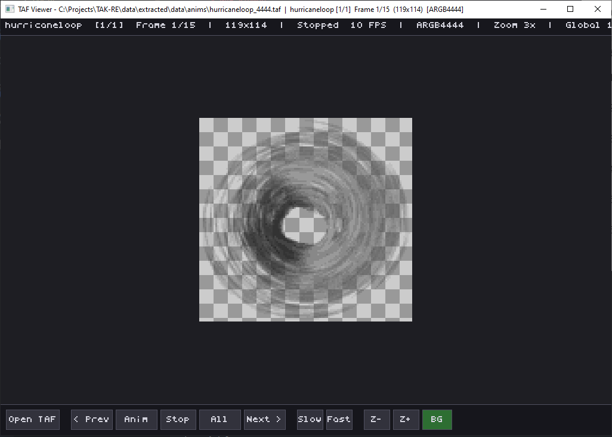

# TAF Viewer

A cross-platform viewer for **TA: Kingdoms** TAF (Truecolor Animation Format) sprite files.



## What are TAF files?

TAF is TAK's upgrade to the GAF format. While GAF sprites use 8-bit palette indices (requiring a separate palette file for correct colors), TAF sprites store **16-bit truecolor** pixels directly -- no palette needed. Each pixel contains its own color information.

TAF files come in pairs:
- `*_1555.taf` -- ARGB 1555 format (1 bit alpha, 5 bits each for R, G, B)
- `*_4444.taf` -- ARGB 4444 format (4 bits each for A, R, G, B)

The original engine selects between them based on video card capabilities. The `_4444` variant has better transparency (16 alpha levels vs just on/off) but slightly less color precision. Both are supported by this viewer.

TAF files are used in TAK for effects, explosions, sparkles, blood splashes, and other visual elements that benefit from transparency gradients.

## Download

Pre-built binaries are available on the [Releases](../../releases) page:

| Platform | Download |
|----------|----------|
| Windows  | `taf-viewer-windows.zip` -- extract and run `taf-viewer.exe` |
| Linux    | `taf-viewer-linux.tar.gz` -- extract and run `./taf-viewer` |
| macOS    | `taf-viewer-macos.tar.gz` -- extract and run `./taf-viewer` |

No installation required. Just download, extract, and run.

## Usage

```
taf-viewer [file.taf]
```

You can also launch with no arguments and use **Open TAF** or drag & drop.

**Examples:**
```bash
# View a TAF effect sprite
taf-viewer bigburst_1555.taf

# View the 4444 variant (better alpha)
taf-viewer bigburst_4444.taf

# Launch and drag & drop
taf-viewer
```

**No palette needed!** Unlike GAF files, TAF files contain direct color -- they just work.

## Controls

### Keyboard

| Key | Action |
|-----|--------|
| Left / Right | Step through all frames (crosses entry boundaries) |
| Up / Down | Jump between entries |
| Space | Play/pause entry animation (game-style) |
| A | Play/pause all-frames animation |
| O | Open TAF file |
| F | Toggle checkerboard transparency background |
| + / - | Zoom in / out |
| [ / ] | Slower / faster animation |
| Escape | Quit |

### Toolbar Buttons

| Button | Action |
|--------|--------|
| Open TAF | Open a TAF file via file dialog |
| < Prev / Next > | Step through frames |
| Anim | Play/pause entry animation |
| Stop | Stop animation |
| All | Play/pause all-frames animation |
| Slow / Fast | Adjust animation speed |
| Z- / Z+ | Zoom out / in |
| BG | Toggle checkerboard transparency background |

## Supported Formats

| Format | Frame field | Pixel layout | Alpha |
|--------|------------|--------------|-------|
| ARGB 1555 | `format=5` | 1 bit A, 5 bits R, 5 bits G, 5 bits B | On/off only |
| ARGB 4444 | `format=4` | 4 bits A, 4 bits R, 4 bits G, 4 bits B | 16 levels |

Pixel data is raw uncompressed: `width * height * 2` bytes. `0x0000` = fully transparent.

## Building from Source

**Requirements:** CMake 3.16+, a C compiler, SDL2.

### Windows (with vcpkg)
```bash
cmake -B build -DCMAKE_TOOLCHAIN_FILE=[vcpkg-root]/scripts/buildsystems/vcpkg.cmake
cmake --build build --config Release
```

### Linux
```bash
sudo apt install libsdl2-dev
cmake -B build -DCMAKE_BUILD_TYPE=Release && cmake --build build
```

### macOS
```bash
brew install sdl2
cmake -B build -DCMAKE_BUILD_TYPE=Release && cmake --build build
```

## Related Tools

- [tak-gaf-viewer](https://github.com/zbennett10/tak-gaf-viewer) -- Viewer for GAF (8-bit paletted) sprite files from both TA and TAK

## License

MIT License. See [LICENSE](LICENSE) for details.

## Credits

- TAF format reverse-engineered from the TA: Kingdoms game binary
- Built for the Total Annihilation and TA: Kingdoms modding community
